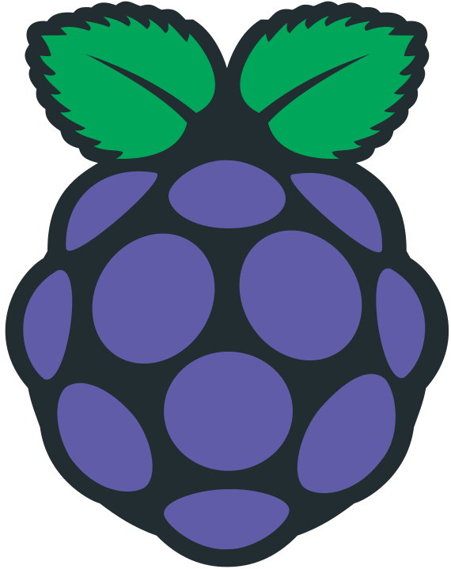

<!-- Project Header -->
<div align="center">
  

  <h1 class="projectName">Custom Pi-hole Interface</h1>

  <p class="projectBadges">
	<a href="https://unmaintained.tech/">
      
    </a>
    
    
    
    <a href="LICENSE">
      
    </a>
  </p>
  
  <p class="projectDesc">
    A custom web interface for Pi-hole, a DNS-based ad filter
  </p>
  
  <br/>
</div>


> **Note:** I've marked this project as **UNMAINTAINED** because it hasn't seen an update in a while. You can still fork/download/use this project at your own risk, but I won't be able to provide support or updates. [More details](https://unmaintained.tech)


## About
This project is forked from the [Pi-hole Admin Dashboard](https://github.com/pi-hole/AdminLTE), which was made using [AdminLTE](https://almsaeedstudio.com).

This project will create a Web interface for the ad-blocking [Pi-hole](https://github.com/pi-hole/pi-hole). From this interface, you will be able to see stats on how well your Pi-hole is performing and update the lists used to block ads. The goal of this project is to make a lighter, more feature-packed version of the interface created by the Pi-hole team.


## Installation
Use the following commands to manually install this web interface:
1. Change to the web server directory: `cd /var/www/html`
2. (If updating) Remove the previous version of the web interface: `sudo rm -r admin/`
3. Clone the repository into a new `admin` folder: `git clone --depth 1 https://github.com/jerboa88/Custom-PiHole-Interface.git admin`
4. (Optional) Remove unused files: `sudo rm -r admin/.git/ admin/.github/`
5. Profit!


## Screenshots
Desktop site | &#8291;
:-:|:-:
 | 
 | 

Mobile site | &#8291;
:-:|:-:
 | 
 | 


## API
A read-only API can be accessed at `/admin/api.php` that returns a JSON response similar to the following:
```JSON
{
	"domains_being_blocked": "136,708",
	"dns_queries_today": "18,108",
	"ads_blocked_today": "14,648",
	"ads_percentage_today": "80.9"
}
```

The following query parameters can be used to access other information from the API:
- `?summaryRaw`
- `?overTimeData`
- `?topItems`
- `?recentItems`
- `?getQueryTypes`
- `?getForwardDestinations`,
- `?getQuerySources`
- `?getAllQueries`


## Contributing
This project is unmaintained and as such, I am no longer accepting pull requests. If you have something to add, feel free to fork this project.


## License
This project is licensed under the [MIT License](LICENSE).
