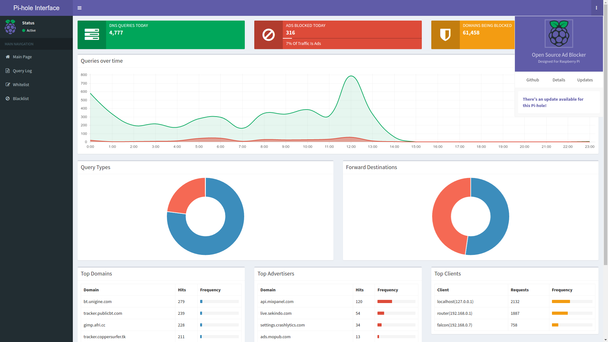
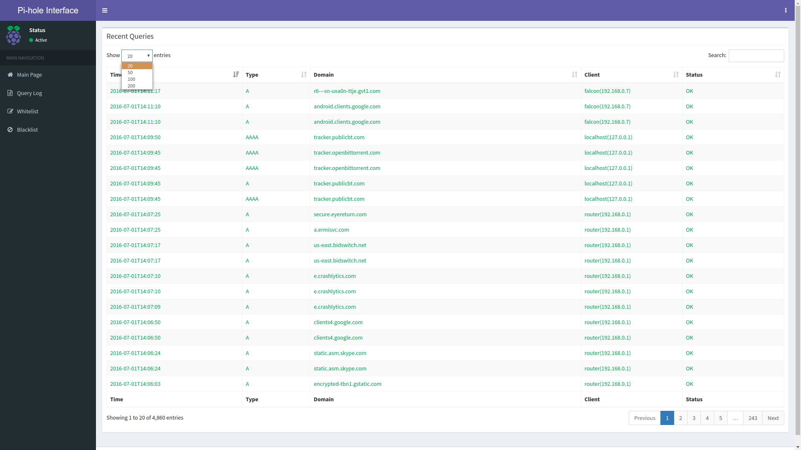
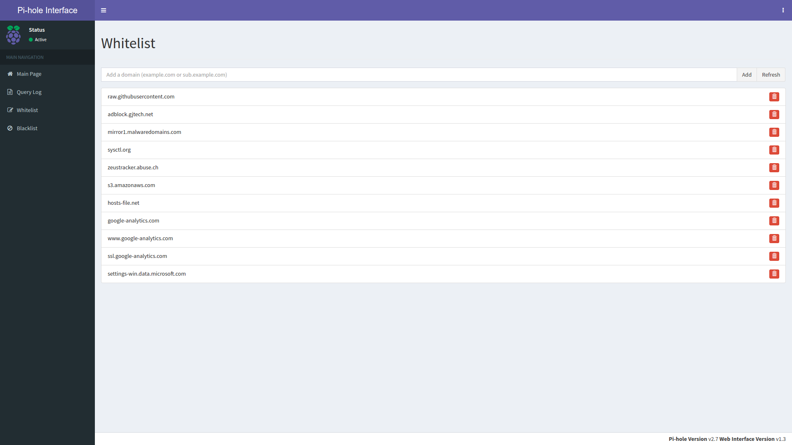
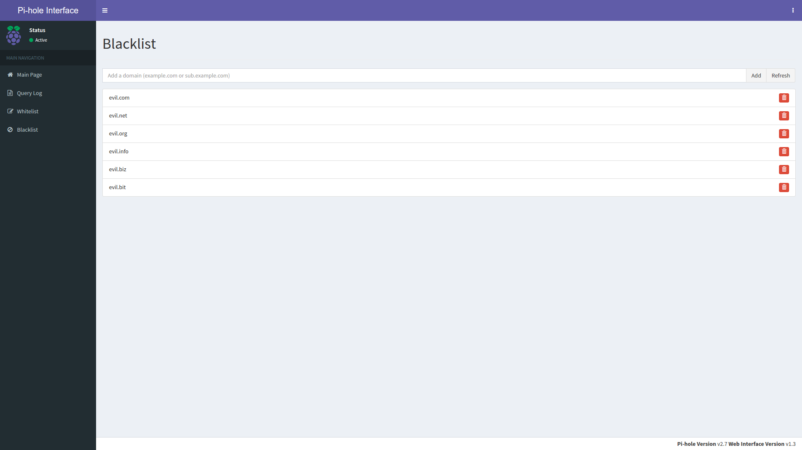
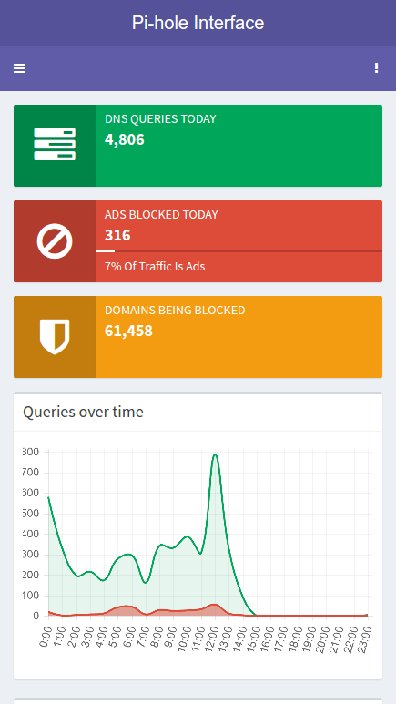
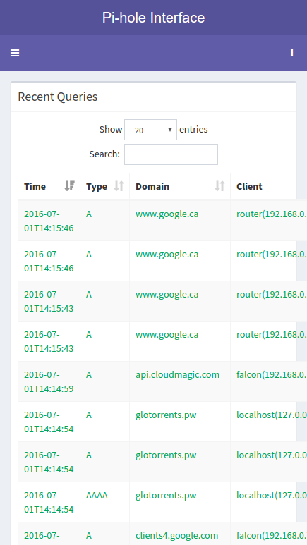
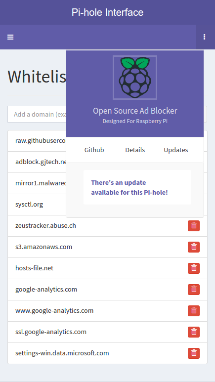
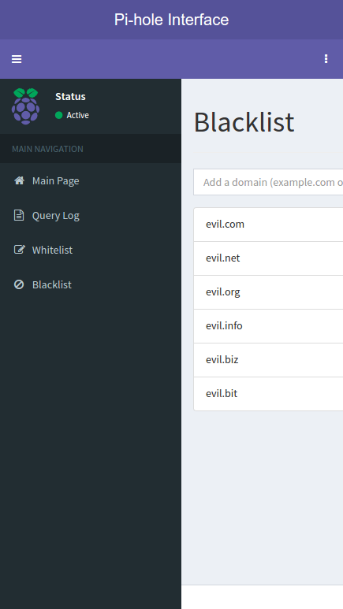

# Custom Pi-hole Interface v1.4


### Install
I am plannng on making an install script to make this super easy/snazzy but for now just do this. It is pretty self-explanatory but I've included comments anyways. Make sure you don't paste those into the terminal.
```sh
cd /var/www/html    # Change to the web server directory
sudo rm -r admin/   # Remove a previous version of the web interface (Do not do this if you are installing from scrath. This step is only needed if you are updating)
git clone --depth 1 https://github.com/jerboa88/Custom-PiHole-Interface.git admin   # Download (clone) the repository into the admin/ folder
sudo rm -r admin/.git/ admin/.github/   # (Optional) Remove uneeded files
```
That's it!


### About
This project is forked from the [Pi-hole Admin Dashboard](https://github.com/pi-hole/AdminLTE), which was made using [AdminLTE](https://almsaeedstudio.com) and released under the MIT License. Modifications to this project made by me or others is also licensed under MIT.

This project will create a Web interface for the ad-blocking [Pi-hole](https://github.com/pi-hole/pi-hole). From this interface, you will be able to see stats on how well your Pi-hole is performing and update the lists used to block ads. My goal, ultimately, is to make a lighter, sexier, more feature-packed version of the interface created by the Pi-hole team.

Here are some screenshots:
<div style="display:flex">
<a href="screenshots/desktop_main.png"></a>
<a href="screenshots/desktop_queries.png"></a>
<a href="screenshots/desktop_whitelist.png"></a>
<a href="screenshots/desktop_blacklist.png"></a>
</div>
<div style="display:flex">
<a href="screenshots/mobile_main.png"></a>
<a href="screenshots/mobile_queries.png"></a>
<a href="screenshots/mobile_whitelist.png"></a>
<a href="screenshots/mobile_blacklist.png"></a>
</div>


### API
A read-only API can be accessed at `/admin/api.php`. With either no parameters or `api.php?summary` it returns the following JSON:
```JSON
{
	"domains_being_blocked": "136,708",
	"dns_queries_today": "18,108",
	"ads_blocked_today": "14,648",
	"ads_percentage_today": "80.9"
}
```

There are many more parameters, such as `summaryRaw`, `overTimeData`, `topItems`, `recentItems`, `getQueryTypes`, `getForwardDestinations`, `getQuerySources`, and finally `getAllQueries`.


### Contributing
This is actually just a personal project, but if you think you have something usefu to add, you can submit a pull request. A couple formatting things:
- Use tabs, not spaces
- Use semicolons only when neccesary

I have some other formatting quirks but those are likely personal problems.
